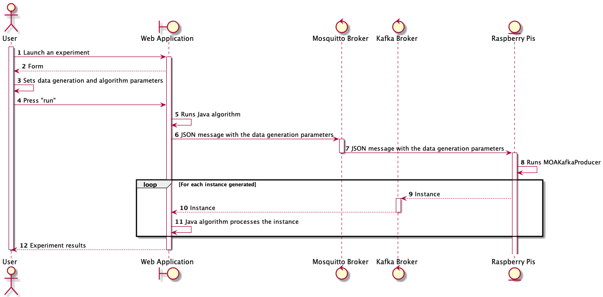

# README

## Project description

This is the repo for **DSMRWeb** which stands for **Data Stream Mining for Raspberry**, an end-of-degree project that focuses on Data Stream Mining. This project consists on a Web Application whose aim is to launch experiments (letting the user choose the algorithms and the value of a set of parameters) on the data generated by three raspberry boards and permit the visualization of the experiments results. Apart from the Data Stream Mining side, this application also has an interactive map displaying various locations, this locations are sensors and reference the actual Raspberry boards that feed data into our Application's experiments; the user can create, read, update and delete sensors through this interactive map.

## Software used

In this section details concerning the software used on different parts of the project will be summarized.

The data generated by the Raspberry boards is synthetic and programmed via  [MoA](https://moa.cms.waikato.ac.nz/), an open source framework for Data Stream Mining; and will be sent to the server using [Apache Kafka](https://kafka.apache.org/), an open-source distributed event streaming platform.

This Application uses the **Ruby on Rails** framework for the backend, and the JavaScript library **React** for the frontend. In order to integrate React into Ruby on Rails, the [Webpacker](https://github.com/rails/webpacker#installation) gem was needed; this gem grants Ruby on Rails the use of the bundler Webpack, which is responsible for the managing of application-like JavaScript.

The [Axios](https://github.com/axios/axios) library for JavaScript is used to retrieve data from the API on the React components.

[Bootstrap v5.0](https://getbootstrap.com/docs/5.0/getting-started/introduction/) is being used in the views and modals of this Application.

For the map part of this application the library [React Leaflet](https://react-leaflet.js.org/) was used, this library provides React components for [Leaflet](https://leafletjs.com/) maps, Leaflet is itself a Javascript library for interactive maps. The use of React Leaflet accelerated the developing process as it already integrates Leaflet's maps on React.

Multiple Ruby gems (Ruby libraries) were used in this project, these gems are:

* [Active Model Serializers](https://github.com/rails-api/active_model_serializers). This gem was used for the serialization of the sensor objects in the context of a request to the sensor's controller in the App.
* [Rails Internationalization (I18n) API](https://guides.rubyonrails.org/i18n.html). This gem was used to translate the error messages returned in the API calls in the context of the creation or update of a sensor in the App.
* [Mysql2](https://github.com/brianmario/mysql2). This gem was used to implement a MySQL database on the Ruby on Rails backend.
* [Ruby-mqtt](https://github.com/njh/ruby-mqtt). This gem implements an MQTT client for Ruby, it was used to enable the communication between the server and the MQTT broker [Mosquitto](https://mosquitto.org/).

As for React the only React library used in this project is [Wouter](https://github.com/molefrog/wouter), used for the routing between React components.

## Implementation

In this section details related to the implementation of this Web Application will be discussed such as the React Components implemented, the Ruby classes used in the backend and the implementation of the communication between the server and the Raspberry boards.

### Front-end

The Front-end part of this Web Application has been implemented with Javascript's library **React**, to style every React Component **Vanilla CSS** and **Bootstrap** have been used.

#### React Components

In this section, the React Components implemented will be listed and their function summarized.

- App. This is the main Component of the whole Web Application, it was created by default by Webpack, it's where the main page it's rendered.
- Home. This Component renders the main page of the Web Application and its Components, i.e. the map and the sidebar.
- Map. This Component contains the map visualization, its functionality and modals. To create a new marker on the map the user must double click in the desired location and then fill the form of the modal that will pop up. To edit a marker the user must click on the marker and push the "Edit" button, then a modal will pop up with the data of the marker and the user will be able to edit whatever fields he needs (except for the latitude and longitude fields). To delete a marker the user must click on the marker and push the "Delete" button and confirm the action. The Map Component contains all the logic related to the creation, edition and deletion of the markers in the map, rendering the SensorFormModal Component and the DeleteModal Components when the user pushes the corresponding buttons; also uses the ClickLocation subcomponent to get the latitude and longitude of the location selected by the user on the map with a double click.
- SensorFormModal. This Component renders the modal that will pop up when editing or creating a new marker, if its rendered in the creation case all fields will be blank, if its rendered in the editing case all fields will contain the information of the sensor that is being edited. Data validation will be done in the backend, displaying an error message below the modal field with invalid data indicating the reason why it's invalid; the only verifications made are that all fields (except the information field) must be filled and that the information field lenght must be under 200 characters.
- FormFieldError. This Component represents an error message on a form field, it only renders an error message in color red.
- DeleteModal. This Component renders a modal that will pop up on the deletion of a marker asking confirmation to the user, if the user confirms that he wants to delete the selected marker or sensor, the API request will be sent to delete it; if not, the modal will close.
- Sidebar. This Component renders the sidebar that contains the buttons to pop up the experiment modal and the experiment results modal.
- LaunchExperimentModal. This Component renders the modal that contains the form for the algorithm parameters and the data generator parameters; the user can select between different algorithm and generators, when one algorithm or generator is selected its fields will be generated with default values. In this form the data validation is done with client-side validation, checking if every field isn't null. If the user places the cursor over the data generator parameters, a Tooltip will appear with an explanation of the field.

#### JavaScript services

In this section all the JavaScript functions used to send API requests will be listed.

- getSensors. Sends an API request to get all the sensors stored in the database.
- createSensor. Sends an API request to create a sensor with the data written by the user.
- updateSensor. Sends an API request to update the data of the selected sensor with the data written by the user.
- deleteSensor. Sends an API request to delete the sensor selected.
- getAlgorithms. Sends an API request to get the name of all the algorithms stored in the algorithms directory of the Web Application.
- getAlgorithmParams. Sends an API request to get the parameters of the algorithm selected by the user.
- getGenerators. Sends an API request to get all the generators stored in the generators directory of the Web Application.
- getGeneratorParams. Sends an API request to get the parameters of the generator selected by the user.
- launchExperiment. Sends an API request to run an algorithm and the data generator script with the given parameters.
- checkAlgorithmRunning. Sends an API requests to check if there's an experiment being made.

### Back-end

As stated before, the Back-end part has been implemented with **Ruby on Rails** framework.

#### Database

The database system used in this project is MySQL. The only table created in the database is the sensor table with the latitude, longitude, location, IP address and information attributes.

#### Models

The only model implemented in this Web Application is the sensor model. It validates the presence of the latitude, longitude, location, IP address attributes and that the length of the information attribute doesn't excede 200 characters.

#### Controllers

In this section, the controllers implemented will be listed and their function will be summarized.

- Sensors controller. This controller is used to represent the interaction with a sensor object within the context of the Web Application. This controller has 5 actions: index (to get all the sensor stored in the database), show (to get the information of the specified sensor), create (to create and store a new sensor in the database), update (to edit the information of a sensor) and destroy (to delete a sensor from the database).
- Generators controller. This controller is used to process any interaction related to the data generators. This controller has 2 actions: index (to get all the data generators stored in the generators directory) and show (to get the parameters of the specified data generator from its file in the generators directory).
- Algorithms controller. This controller is used to process any interaction related to algorithms. The behaviour and use of this controller is identical to the generators controller, it implements 2 actions: index (to get all the algorithms stored in the algorithms directory) and show (to get the parameters of the specified algorithm from its correspondant file in the algorithms directory).
- Experiments controller. This controller is used to process any interaction related to experiments, i.e. the execution of an algorithm with the specified data generators. This controller implements 2 actions: index (to check if there's an experiment running at the moment) and create (to launch an experiment with the specified parameters of the algorithm and the data generators).

#### Services

Services are Ruby classes implemented to bring support to the controllers. The services implemented are:

- Algorithm file reader service. This service was implemented to get all the algorithms' names from the algorithms directory and also to get the information of a specific algorithm by processing its file.
- Algorithm executing checker service. This service is used to check if there's an experiment running at the moment by checking if the algorithm config file exists in the experiments directory.
- Algorithm params writer service. This service was implemented to create two important files needed by the Java algorithm to run, these files are the algorithm configuration file (algorithm_config.txt) and the dataset file (dataset.arff).
- Experiment file cleaner service. This service was implemented to delete all the files generated by the Java algorithm.
- Generator file reader service. This service is identical to the algorithm file reader service, it's used to get all the generators' names from the generators directory and also to get the information of a specific generator by processing its parameter file.
- Script running service. This service was implemented to run the MOAKafkaProducer script to get the stream header file, needed by the Java algorithm.
- MQTT client publisher service.

#### Serializers

The only serializer used in this Web Application is the Sensor serializer.

### Files format

Some files have been used to store information of an object instead of creating a database table. This files will be listed and its format summarized in this section.

#### Algorithm file

This file stores the information of an algorithm, it contains multiple lines with 3 fields separated with semicolons, every line represents a parameter; as for the fields: the first one represents the name of the parameter, the second one represents its identifier in the algorithm configuration file and the last one represents its default value. These files are stored in the algorithms directory.

#### Generator file

This file stores the information of a data generator, it contains multiple lines with 4 fields separated with semicolons, every line represents a parameter; as for the fields: the first one represents the parameter flag in the command that will be run, the second one represents an explanation of the parameter function, the third one represents the default value of the parameter, and the last one represents the type of the parameter, i.e. if it's numeric or a boolean. These files are stored in the generators directory.

### Communication between the server and the Raspberry Pis

As has been stated before one of the principal tasks of the Web Application is the launch of experiments with the data generated by three
Raspberry boards. This experiments will consist in the execution of a certain algorithm (picked by the user along with the value for its parameters) that will process the generated data (the data generators are also parametrized, so the user can pick the generators and use the values of his choice).

Hence, there's a two way communication between the server and the Raspberry boards, this communication breaks in two streams: one from the server to each Raspberry board (related to the parameters for the data generation with **MOA**), and the other from each Raspberry board to the server (related to the generated data itself). Each stream uses a different approach and different technologies for the communication, so both will be explained in detail.

#### Communication from the server to the Raspberry boards

For the first stream, the **MQTT** protocol is used to sent the data generation parameters from the server to each Raspberry board. Each Raspberry board will subscribe to the topic experiments on the **Mosquitto** broker of the server, and will process the JSON message received from the server to run the script **MOAKafkaProducer** that will generate the data with the configuration of the already mentioned message. To do this, every Raspberry Pi will run on boot (using a Cron job scheduled with Crontab) a script called **RaspberryMQTTClient**, this script written in Python uses Paho MQTT library to connect to the Mosquitto broker and process every message sent by the server.

From the perspective of the Web Application this communication is established when the user configures the algorithm and data generation parameters and launches a experiment, this request is received by the server and (after starting the Java algorithm that will wait for the data to be generated) it will create a MQTT Client using the **Ruby-MQTT** library that will publish a JSON message to the topic experiments with the parameters for the data generation and then will disconnect itself from the broker. It's important to say that this MQTT client is created in every request to launch an experiment made from the client to the server.

#### Communication from the Raspberry boards to the server

This stream is much simpler, once the JSON message is received by the Raspberry boards, each Raspberry will run the script **MOAKafkaProducer** with the given configuration. This script written in Scala, will create an **Apache Kafka Producer** that will send to the Kafka Broker a stream of MoA instances that will be collected and processed by the Java algorithm. Once the script has sent all the instances detailed on the message it will finish its execution, ending the established communication between the Raspberry boards and the server to launch a experiment.

To finish this section a sequence diagram is included to sum up the interactions on the communication between the server and the Raspberry boards.

